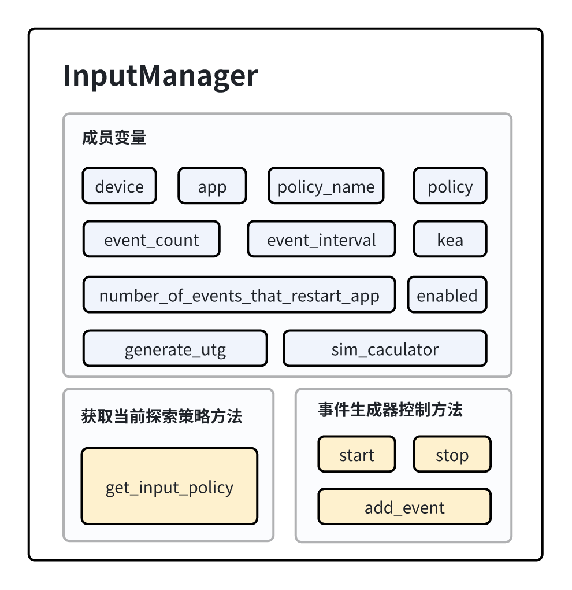

InputManager
================

InputManager类是事件生成器的控制类，负责启动、停止事件的生成，并在测试期间向应用程序运行发送生成的所有事件。InputManager所包含的主要方法有：

- 获取当前测试用户所选择的探索策略。
- 添加事件到设备的执行事件列表等待执行。
- 使用当前探索策略开始生成事件进行测试。
- 停止生成事件，结束此次测试。

    InputManager 类的组成

.. note::
        
    为了便于读者理解，本文中提供的代码段简化版本仅对核心流程进行抽象并展示，实际代码与简化的参考代码不完全一致。

InputManager类中的数据结构
---------------------------

1. **device**

   device是Device的对象，用于记录当前测试的设备信息,便于后续对设备的交互操作。

2. **app**
   
   app是App的对象，用于记录当前所测试的移动应用的信息。

3. **policy & policy_name**
   
   policy_name是string类型，用于存储用户所选择的探索策略名。policy是具体探索策略类的对象。

4. **event_count & event_interval & number_of_events_that_restart_app**
   
   这三个成员变量均为整型。event_count记录从测试开始到现在生成的事件个数；event_interval记录了用户设置的两个事件之间停顿的时间；
   number_of_events_that_restart_app为多少个事件后需要重启应用程序。

5. **kea**
   
   kea为Kea类的对象，用于生成事件过程中从Kea类中取出记录数据来完成对应用性质的测试。

6. **enabled**
   
   enabled为bool类型，用于记录当前事件生成器是否需要继续生成事件，默认值为True。

7. **generate_utg**

   enerate_utg为bool类型用于记录用户所设置的是否生成UI转移图的参数，便于生成事件的过程中判断是否应该生成UI转移图。

8. **sim_caculator**

   sim_caculator为Similarity的对象，用于计算上一个界面状态与当前界面状态之间的相似性。

InputManager类中的成员方法
---------------------------

获取探索策略的方法
~~~~~~~~~~~~~~~~~~~~~~~

1. **get_input_policy**

    get_input_policy 方法根据用户所选择的policy_name来实例化对应的探索策略对象。实例化的对象存储在policy成员变量里。

    .. code-block:: python

        def get_input_policy(self, device, app):
            if self.policy_name == POLICY_NONE:
                input_policy = None
            elif self.policy_name == POLICY_GUIDED:
                input_policy = GuidedPolicy(device,app,self.kea,self.generate_utg)
            elif self.policy_name == POLICY_RANDOM:
                input_policy = RandomPolicy(device, app, self.kea, self.number_of_events_that_restart_app, True, self.generate_utg)
            elif self.policy_name == POLICY_LLM:
                input_policy = LLMPolicy(device, app, self.kea, self.number_of_events_that_restart_app, True, self.generate_utg)
            else:
                input_policy = None
            return input_policy

事件生成器的控制方法
~~~~~~~~~~~~~~~~~~~~~~~

1. **start**
   
   start 方法用于启动所选定的探索策略。

   .. code-block:: python

        def start(self):
            try:
                if self.policy is not None:
                    self.policy.start(self)
            except KeyboardInterrupt:
                pass
            self.stop()

2. **stop**
   
   stop 方法用于结束探索过程。

   .. code-block:: python

        def stop(self):
            self.enabled = False

3. **add_event**
   
   add_event添加一个事件到事件列表，并将该事件发送给移动设备。

   .. code-block:: python

        def add_event(self, event):
            if event is None:
                return
            self.events.append(event)
            event_log = EventLog(self.device, self.app, event)
            event_log.start()
            while True:
                time.sleep(self.event_interval)
                if not self.device.pause_sending_event:
                    break
            event_log.stop()