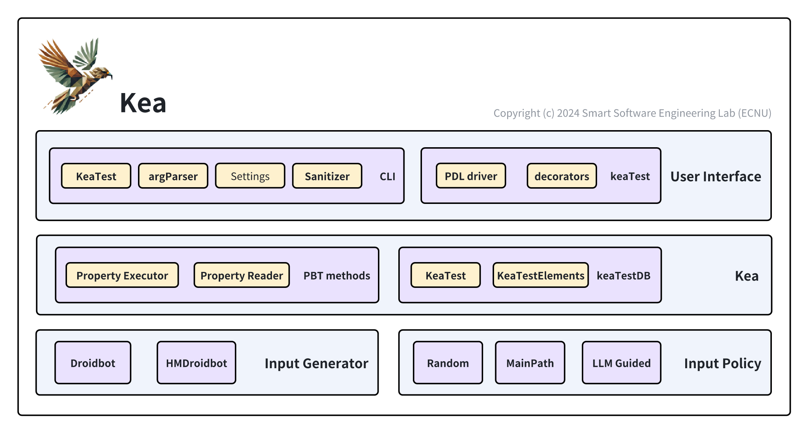

整体架构设计
=============================

架构图
------------------

    Kea 架构图

目录结构
------------------

.. code-block:: 

    .
    ├── LICENSE
    ├── README.md
    ├── config.yml
    ├── example/
    ├── kea/
    │   ├── __init__.py
    │   ├── resources/
    │   ├── adapter/ 
    │   │   ├── __init__.py
    │   │   ├── adapter.py
    │   │   ├── adb.py         // adb交互操作库
    │   │   ├── cv.py          // cv库，用于图像匹配等
    │   │   ├── hdc.py         // hdc交互操作库
    │   │   ├── hilog.py       // 鸿蒙hilog操作库
    │   │   ├── logcat.py      // 安卓logcat操作库
    │   │   ├── minicap.py     // 安卓minicap操作库
    │   │   └── uiautomator2_helper.py  // uiautomator2操作库
    │   ├── app.py              // 安卓应用解析库
    │   ├── app_hm.py           // 鸿蒙应用解析库
    │   ├── Bundle.py           // statefult testing 库
    │   ├── device.py           // 安卓设备库
    │   ├── device_hm.py        // 鸿蒙设备库
    │   ├── device_state.py     // 状态抽象库
    │   ├── droidbot.py     
    │   ├── droidmaster.py      
    │   ├── env_manager.py
    │   ├── input_event.py      // 输入事件
    │   ├── input_manager.py    // 输入(策略)管理器
    │   ├── input_policy.py     // 输入策略库 
    │   ├── intent.py           // intent 操作库
    │   ├── kea.py              // kea工具
    │   ├── android_pdl_driver.py       // 安卓PDL驱动
    │   ├── harmonyos_pdl_driver.py     // 鸿蒙PDL驱动
    │   ├── similarity.py       // 组件树结构相似度比对库
    │   ├── start.py
    │   ├── kea_test.py
    │   ├── utg.py
    │   └── utils.py
    ├── properties/
    └── setup.py

各功能部分设计文档
--------------------------

.. toctree:: 
    user-interface/cli/cli.rst
    user-interface/keaTest-suite/kea-test.rst
    user-interface/keaTest-suite/decorators.rst
    user-interface/keaTest-suite/pdl_driver.rst
    kea/keaTestElements.rst
    kea/kea.rst
    fuzzer/droidbot.rst
    fuzzer/hmdroidbot.rst
    InputGenerator/InputManager
    InputGenerator/random
    InputGenerator/MainPath Guided Policy
    InputGenerator/llm
    stateful_testing/Bundle