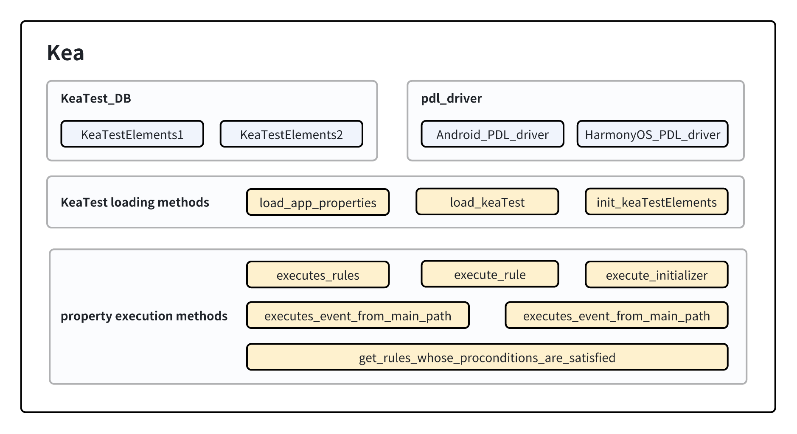

Kea
===========================

Kea类是工具中的核心类，为工具中与基于性质测试相关功能的控制器。在Kea类中，存储的内容和对外暴露的方法主要有：

- 加载所有KeaTest并读取至KeaTest至KeaTestElements的相关方法。
- 存储用户定义的所有KeaTestElements。以及访问这些性质相关函数(initializer, rule, mainPath)的方法。
- 存储当前运行的PDL驱动（含安卓与鸿蒙系统）。以及设置当前要运行的PDL驱动的方法。
- 性质的前置条件检查器方法，返回当前应用界面中通过了前置条件的性质。
- 执行一条性质的交互场景的方法。
- 执行主路径步骤的方法。

    Kea 类的组成

Kea类中的数据结构
-----------------------

1. **KeaTest_DB**
   
   KeaTest_DB是Kea运行时的数据库，用于存储所有的用户自定义性质。每个数据项以 <keaTest, keaTestElements> 
   的键值对方式存储。

2. **pdl_driver**

   pdl_driver 存储的是当前的 PDL (Property Description Languague, 性质描述语言) 的驱动。
   此处存储的是鸿蒙或安卓设备的驱动，主要用于执行主路径中的某一步。

Kea类中的成员方法
-------------------------

读取性质的相关方法
~~~~~~~~~~~~~~~~~~~~~~~

读取性质的相关方法主要对外提供读取用户自定义相关性质的方法。这些性质被读取后会按keaTestElements数据结构的方式组织，
并存储进入KeaTest_DB。

1. **load_app_properties**

   load_app_properties 从用户指定的性质文件中读取性质并存储入Kea，其核心流程如下。

   .. code-block:: 

       1. 去除重复指定的文件。
       2. 对每个文件，检查文件的后缀名是否为.py以确认文件有效性。
       3. 通过导入模块的方式导入用户定义的性质。
       4. 为模块设置对应的系统的pdl_driver。
       5. 检查在步骤3中获得的模块的成员，识别其中的用户定义性质（KeaTest的子类对象）并调用load_KeaTest方法加载他们。
       6. 回到步骤2直至所有用户自定义文件被加载完毕。
   
   具体步骤的简化的python风格代码如下：

   *注：为了描述清晰，简化的代码仅对核心流程进行抽象并展示，实际代码与简化的参考代码不完全一致。
   下文将展示的其他简化代码遵循的规则相同。*

   .. code-block:: python

        @classmethod
        def load_app_properties(cls, property_files):

            remove_duplicated_files(property_files)

            for file in property_files:

                check_file_basename(file)

                module = get_module_name(file)
                
                try:
                    module = importlib.import_module(module_name)

                    # set the pdl driver in the modules (the user written properties)
                    module.d = cls._pdl_driver

                    # find all kea tests in the module and attempt to Load them.
                    for obj in getmembers(module):
                        if is_subclass(obj, KeaTest):
                            cls.load_KeaTest(obj)

2. **load_KeaTest**
   
    load_KeaTest 从 KeaTest 中取出用户自定义的性质（含初始化函数对象、交互场景、主路径函数对象），
    转换为 KeaTestElements 数据结构并存储入 KeaTest_DB 。

    load_KeaTest 的流程如下：

    .. code-block:: 

       1. 初始化一个KeaTestElements，以 <KeaTest, KeaTestElements> 数据项的方式存储进KeaTest_DB
       2. 调用KeaTestElements的方法读取KeaTest中的性质，并存储进KeaTestElements。
    
    其实现通过简化的python代码展示如下：

    .. code-block:: python

        @classmethod
        def init_KeaTestElements(cls, keaTest):

            keaTest_name = get_keaTest_name(keaTest)
            keaTestElements = KeaTestElements(keaTest_name)
            KeaTest_DB.add_item(keaTest, KeaTestElements)
            return keaTestElements 

        @classmethod
        def load_KeaTest(cls, keaTest):

            keaTestElements = cls.init_KeaTestElements(keaTest)
            keaTestElements.load_initializers(keaTest)        
            keaTestElements.load_rules(keaTest)
            keaTestElements.load_mainPaths(keaTest)
    

性质执行相关方法
~~~~~~~~~~~~~~~~~~~~~~~

性质执行的相关方法主要对外提供与性质执行相关功能的接口，主要交由输入策略调用。如获取当前页面通过前置条件的性质，
执行一条性质的交互场景等。