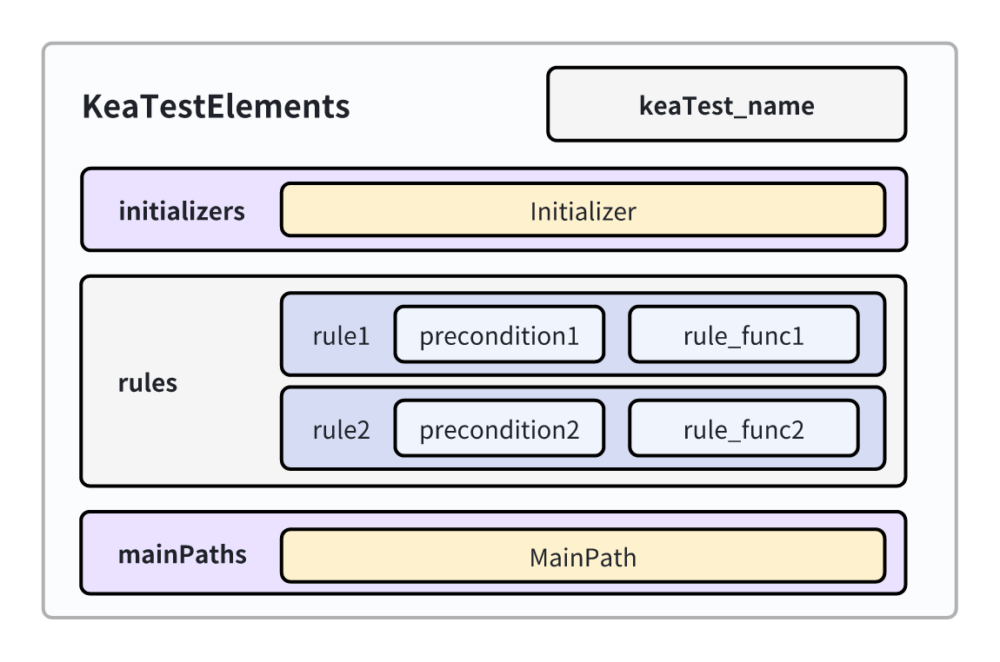
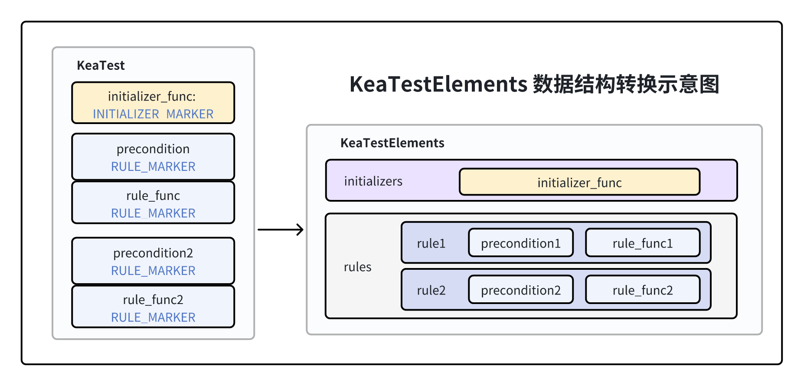

KeaTestElements
=========================

KeaTestElements是Kea运行时存储用户自定义性质的数据结构，与用户继承并自定义的keaTest一一对应。
在kea启动时，keaTestElements会读取每个用户自定义的keaTest，并重新组织为方便kea进行读取的数据结构。
具体的转换过程可参考装饰器一章：:ref:`decorators-keatestelements`。

KeaTestElements的数据结构图示如下：

    KeaTestElements 数据结构

其中，keaTest_name是一个字符串，用于存储用户定义的keaTest的类名。Rules是一个列表，用于存储Rule对象。
Initializers是一个列表，用于存储初始化函数对象Initializer。MainPaths是一个列表，用于存储主要路径对象MainPath。

其中，Rule、MainPath和Initializer对象的数据结构及定义可参见“装饰器”一章。

KeaTestElements的成员方法定义伪代码如下：

.. code-block:: python

    class KeaTestElements:
        def load_rules(keaTest)
        def load_initializers(keaTest)
        def load_mainPaths(keaTest)

load_rules接收一个用户自定义的keaTest对象，读取其中的rule并将一个keaTest中的所有rule存储入rules列表。
load_initializers接收一个用户自定义的keaTest对象，读取其中的初始化函数对象Initializer并将其存储入initializers列表。
load_mainPaths接收一个用户自定义的keaTest对象，读取其中的主路径对象mainPath并将其存储入mainPaths列表。

具体而言，在三个load方法中，均传入一个keaTest对象。这三个类成员方法会在其中查找含有相对应MARKER标记的函数对象，
并将其相应的数据结构（Rule, Initializer和MainPath）以列表的方式组织存储起来。

    KeaTestElements 的成员方法读取KeaTest中的数据，转换为方便Kea使用的数据结构

三个成员方法的具体实现如下：

.. code-block:: python

    def load_rules(self, keaTest:"KeaTest"):
        """
        Load the rule from the KeaTest class (user written property).
        """
        for _, v in inspect.getmembers(keaTest):
            rule = getattr(v, RULE_MARKER, None)
            if rule is not None:
                self.rules.append(rule)

    def load_initializers(self, keaTest:"KeaTest"):
        """
        Load the initializers from the KeaTest class (user written property).
        """
        for _, v in inspect.getmembers(keaTest):
            initializer = getattr(v, INITIALIZER_MARKER, None)
            if initializer is not None:
                self.initializers.append(initializer)

    def load_mainPaths(self, keaTest:"KeaTest"):
        """
        Load the mainPaths from the KeaTest class (user written property).
        """
        for _, v in inspect.getmembers(keaTest):
            mainPath = getattr(v, MAINPATH_MARKER, None)
            if mainPath is not None:
                self.mainPaths.append(mainPath)

