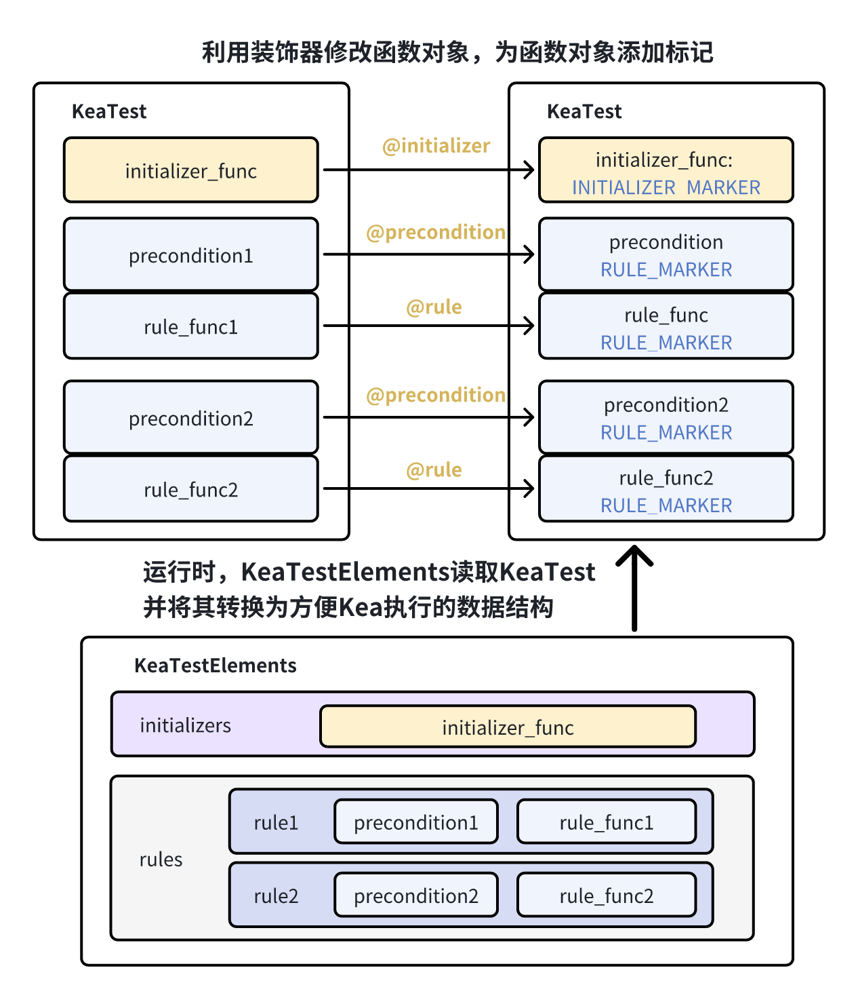

装饰器
=============================

在KeaTest中，使用装饰器定义性质。装饰器的作用是对函数本身进行修改。在Kea中，用户的初始化、前置条件、主路径函数都是一个函数，
我们使用装饰器获取函数体，并对这个函数体进行标记。由于python中函数为一等对象，我们使用装饰器获取函数体后可以动态地往这个函数对象中
设置属性，我们根据不同的装饰器，设置不同的MARKER属性标记。在Kea加载性质的时候，我们读取如下的数据结构，
并将如下的数据结构通过KeaTestElements类进行读取，并转换为方便Kea读取和处理的数据结构：KeaTestElements。

    从用户自定义KeaTest到运行时KeaTestElements的转换

@rule装饰器用于定义一条性质。

.. code-block:: python

    def rule() -> Callable:
        def accept(f):
            precondition = getattr(f, PRECONDITIONS_MARKER, ())
            rule = Rule(function=f, preconditions=precondition)

            def rule_wrapper(*args, **kwargs):
                return f(*args, **kwargs)

            setattr(rule_wrapper, RULE_MARKER, rule)
            return rule_wrapper

        return accept

@precondition前提条件指定了属性何时可以被执行。一个属性可以有多个前提条件，每个前提条件由 `@precondition` 指定。

.. code-block:: python

    def precondition(precond: Callable[[Any], bool]) -> Callable:
        def accept(f):
            def precondition_wrapper(*args, **kwargs):
                return f(*args, **kwargs)

            rule:"Rule" = getattr(f, RULE_MARKER, None)
            if rule is not None:
                new_rule = rule.evolve(preconditions=rule.preconditions + (precond,))
                setattr(precondition_wrapper, RULE_MARKER, new_rule)
            else:
                setattr(
                    precondition_wrapper,
                    PRECONDITIONS_MARKER,
                    getattr(f, PRECONDITIONS_MARKER, ()) + (precond,),
                )
            return precondition_wrapper

        return accept

@initializer定义一个初始化函数，用于应用的初始化，如跳过新手教程等。

.. code-block:: 

    def initializer():
        def accept(f):
            def initialize_wrapper(*args, **kwargs):
                return f(*args, **kwargs)

            initializer_func = Initializer(function=f)
            setattr(initialize_wrapper, INITIALIZER_MARKER, initializer_func)
            return initialize_wrapper

        return accept

主路径指定了一系列事件，从应用起始页执行这些事件会将应用引到至性质的起始状态（满足前置条件的页面）。

.. code-block:: python

    def mainPath():
        def accept(f):
            def mainpath_wrapper(*args, **kwargs):
                source_code = inspect.getsource(f)
                code_lines = [line.strip() for line in source_code.splitlines() if line.strip()]
                code_lines = [line for line in code_lines if not line.startswith('def ') and not line.startswith('@') and not line.startswith('#')]
                return code_lines

            main_path = MainPath(function=f, path=mainpath_wrapper())
            setattr(mainpath_wrapper, MAINPATH_MARKER, main_path)
            return mainpath_wrapper

        return accept