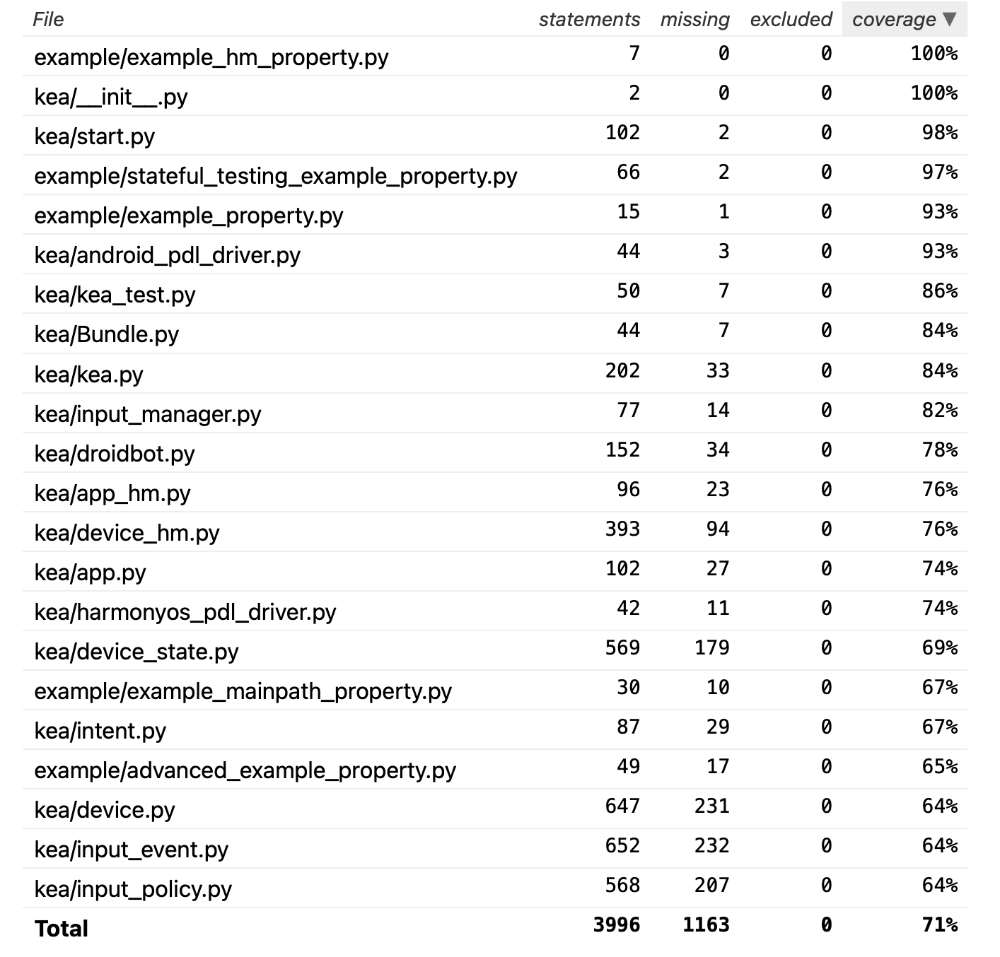

白盒测试
========================

- 使用 Flake8 对 Kea 的代码进行静态分析，检查错误。

- 使用 black 对 Kea 的代码进行重构，以确保代码符合 PEP8 标准。

黑盒测试
=================

我们使用 python coverage 运行 kea 进行覆盖率分析。

其结果如下

    
    kea覆盖率分析整体数据

｜ 覆盖率的详细报告内容可 `点击查看 <../../htmlcov/index.html>`_。