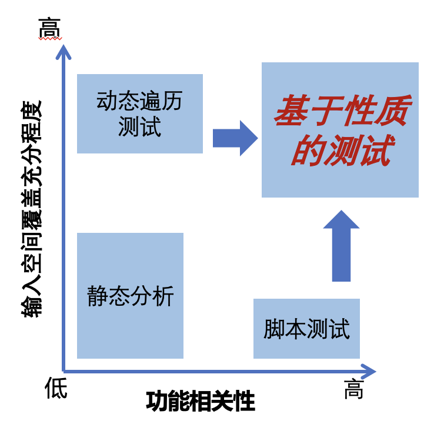

Kea的优势
====================================

.. note::
    根据上面的图像，可以看出静态分析方法在输入空间的充分性和应用功能的相关性方面存在较大不足。
    自动化测试显著提升了输入空间的充分性，但往往未能充分考虑应用功能的相关性；
    相反，人工测试虽然在功能相关性上表现优异，但其输入空间的充分性较差。
    Kea 的核心是基于性质的测试（PBT），旨在同步提升输入空间的充分性和应用功能的相关性。

为了帮助你更清楚地了解它，这里列举了 Kea 的一些优势：

1. 基于性质的测试：Kea 引入了一种通用且实用的测试技术，基于属性性质测试（PBT），能够有效验证应用的功能性。
   
2. 低维护成本：与传统的 UI 测试相比，Kea 的维护成本较低，减少了测试人员的工作负担。

3. 强大的功能缺陷检测能力：Kea 在检测移动应用中的功能性错误方面非常强大，能够自动探索并验证应用的性质，快速发现潜在问题。

